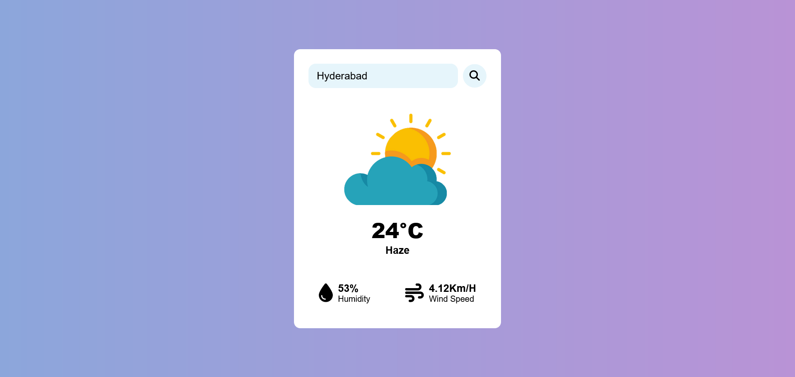
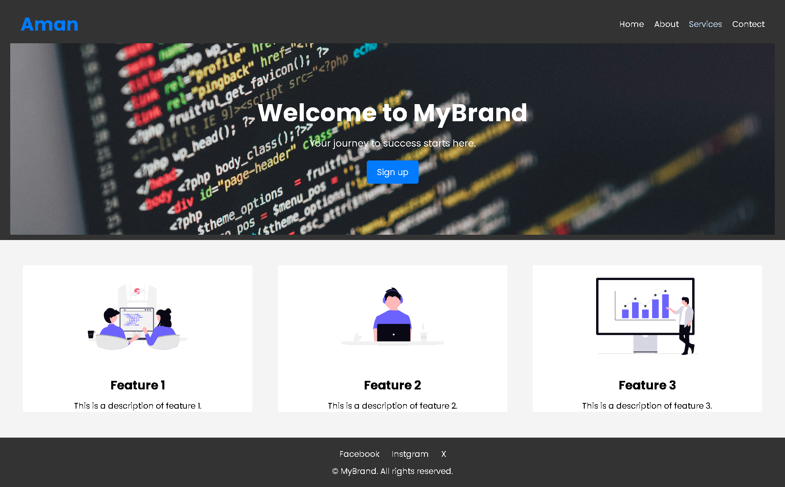
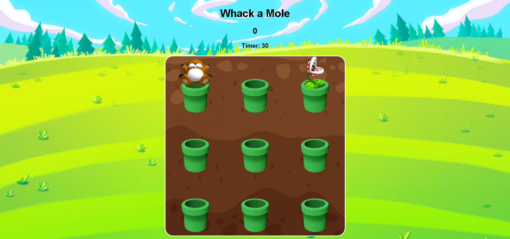

# 30 Days of JavaScript Challenge 🚀

## Day 1: Tip Calculator 💰

## Day 2: Stop Watch ⌚

## Day 3: Meme Generator

## Day 4: TIC TAC TOE 

## Day 5: Weather App

## Day 6: Web site

## Day 7: whack a mole

---

Stay tuned for more updates as I progress through the challenge!
